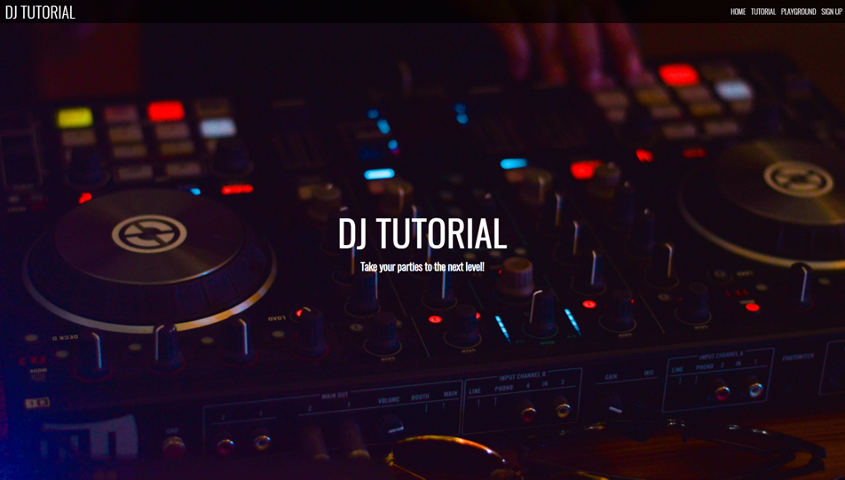
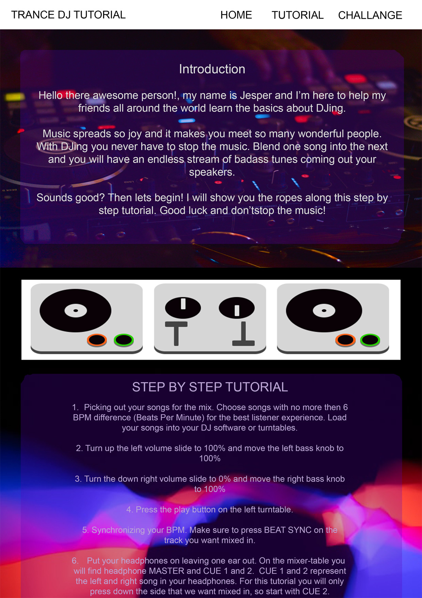
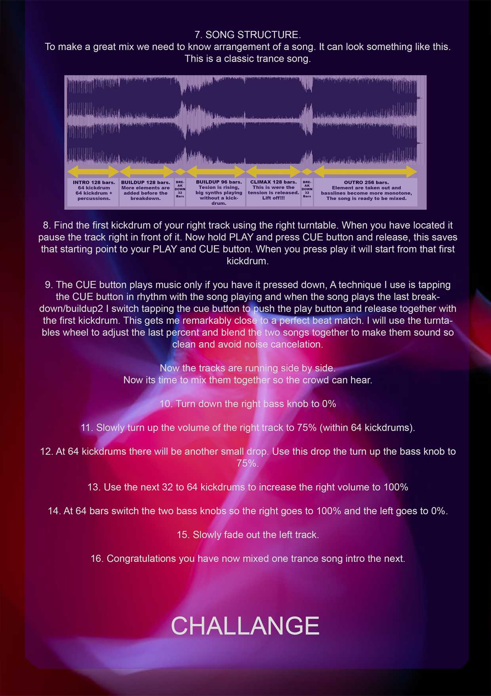
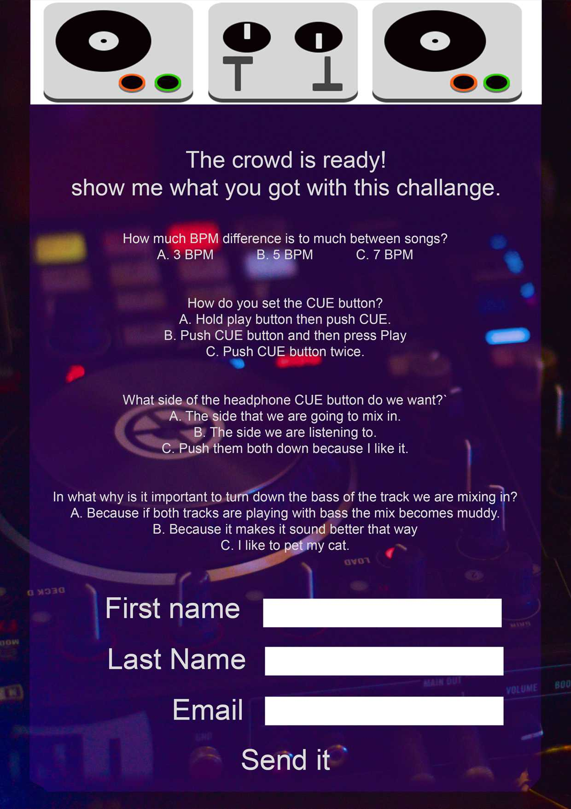
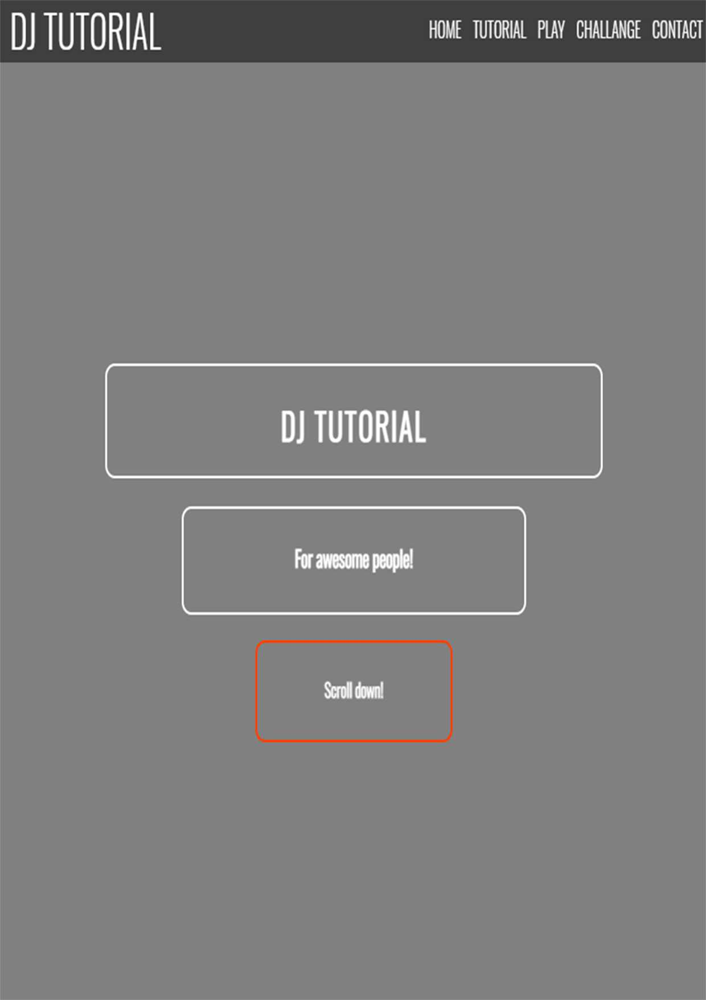
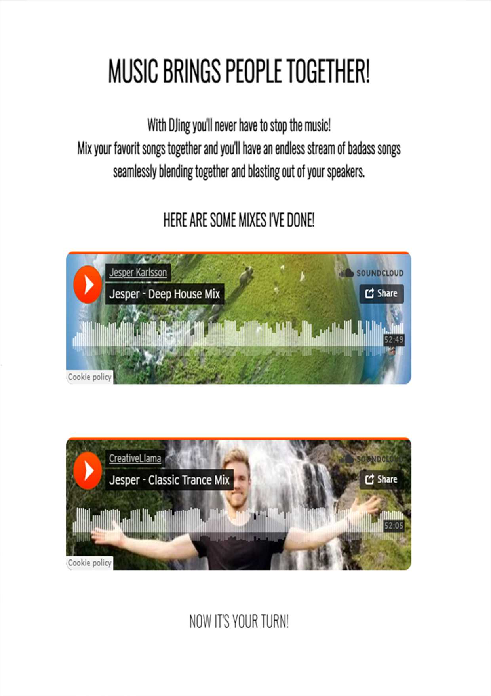
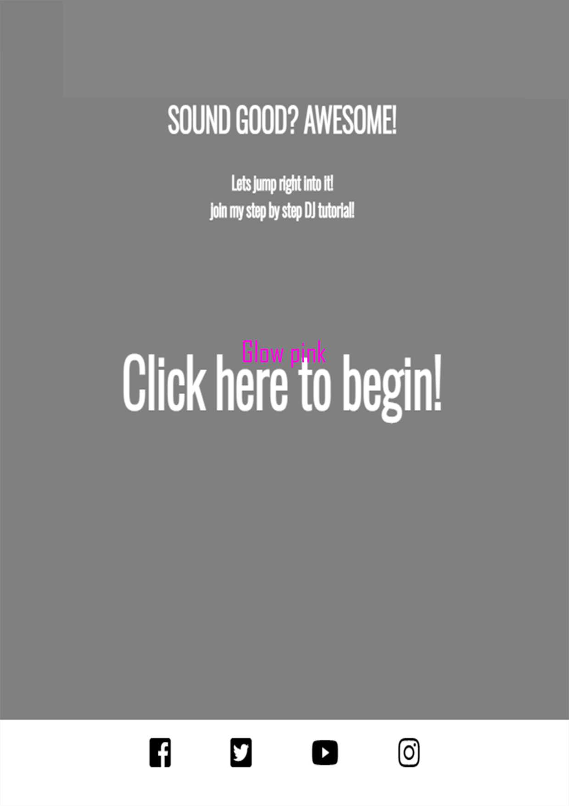

# DJ Tutorial

This project is created to help aspiring DJ's learn the basics all the way up to advanced.
With a step by step structured designed to make it easy to learn and follow along. 

## Showcase

A deployed version of my website can be found [here.](https://jesperkarlsson500.github.io/DJ-Tutorial-MS1/index.html)

## Navigation

* [UX](#ux)
* [Strategy](#strategy)
    + [User-needs](#user-needs)
    + [Business-vision](#business-vision)
* [Scope](#scope)
* [Structure](#structure)
* [Wireframes](#wireframes)
  + [Changes](#changes-to-wireframes)
* [Features](#features)
    + [Existing-features](#existing-features)
    + [Future-features](#futere-features)
* [Technologies](#technologies)
* [Testing](#testing)
+ [Testing-plan](#testing-plan)
  + [Implementation](#implementation)
  + [Results](#results)
* [Bugs](#bugs)
* [Deployment](#deployment)
* [Credits](#credits)
* [Media](#media)
* [Acknowledgements](#acknowledgements)

## UX

The purpose of this website The purpose of this website is to help aspiring DJ's go from beginner to advanced.
Starting with an introduction that leads to a free step by step tutorial.
After the tutorial is over they will be prompted to enjoy the playground were they can listen finished mixes.
For those that seek a deeper understanding and want to follow their dreams to become a DJ, they can sign up 
for a private session with professional DJ.

### UX Stories
 
* As a user I want to learn the basic skills about DJing.
* As a user I want to learn the professional skills about DJ.
* As a user I would like to get inspired in my musical careeer.
* As a user I would to listen to what a DJ can do.
* As a user I want to navigate easily through the content.
* As a user I want to learn in a structured, step by step way.

A user for my website is looking to learn the basics about DJing, through my free step by step totorial.
A user can also book a private session were they will learn the skills to become a professional DJ.

## Strategy

#### User Needs
As a user the site needs to work on desktop, tablet and mobile. 
Be user friendly with clear navigation and flow through the whole experience.

#### Business vision
The purpose of this project is to help aspiring DJs. With the free step by step tutorial they will 
learn the basics. If they want to become a professional DJ, they can signup for private session.
The ultimate goal is to help aspiring DJ's and get private DJ session booked.

## Scope
I want my user to get excited and inspired. 
I want them to find a place were they can learn new skills but also relax and enjoy good music.

## Structure
The project is made up of four pages:
1. Home - The Home page has three sections leading to a call to action; Begin tutorial!
2. Tutorial - Leads to a call to action, go to Playground.
3. Playground - Leads to a call to action, go to Signup.
4. Sign up - Leads to a call to action, Sign up and book a private session.

The idea is to create a natural flow for the user through the pages in that order, 
giving them structure on their journey to become a DJ. 

#### Home
On the Home page you are greeted by a full page image of a DJ's workstation, turntables and a mixer.
This image represents the whole purpose of the site. In section two you have a dark purple background contrasting 
the orange horizontal rule and white text, making it easy to read. In section three, there is another image of 
turntables and a mixer. This time in brighter colors, with white text glowing pink. 
The bright colors are chosen purposefully to make the user excited for the next step.

#### Tutorial
While speaking to my mentor she recommended me to use a carousel to showcase my 
tutorial, This fits really well with my plan to give the user a step by step experience.

#### Playground
This is were the user comes to listen to the end results of what a DJ can do. At the same time inspire them to
signup for a private session.

#### Signup
By signing up the user will be contated through email to book a private sessions with a professional DJ.

## Wireframes

* My first Wireframes

* My second Wireframes

### Changes to wireframes
I had a hard time keeping to my wireframes, since my skills and the vision for the project 
grew while I was working on it. The second wireframes are the closest to the final build. 
I felt I had no time to make new wireframes, so I used the second wireframes and build on that.
I don't recommend this because I had a lot of trail and error. I think this accually took 
more time then making new wireframes.

## Original ideas

The project had three pages full of text and pictures. Mentor Antonija helped me see that 
less is more. She adviced me to create sections on the first page and give the elements some room.

I created a scroll down button on all sections on the Home page to guide the user.
but speaking with my mentor Antonija she asked If that was really necessary. We had a discussion 
and I came to the conclution that you scroll down by instinct when you enter a page, so I took that away.

I wanted to create a decontructed upside down pyramid, created by three 
boxes on the home page. You would have the DJ Tutorial logo on the top box followed by an 
inspirational text and the scroll down text. It would all create the shape of an arrow 
pointing down. The idea was interesting but when I executed it, it diden't turn out so good.
It gave a bad first impression on the page and I oppted to go with less is more.

Renamed and reworked challenge.html and contact.html to playground.html and signup.html.
Reasoning: Playground and Signup sounds more appealing and intuative, It's a better call to action. 

## Features

* Responsive Navbar menu collapsing into a hamburger dropdown menu on tablets and phones.
* Easy navigation through the pages using the navbar.
* Homepage with an images of the workstation of a DJ. 
* Soundcloud links were you can play music.
* The tutorial is in a Bootstrap Carousel for easy step by step user experience.
* Signup form to get in contact with a professional DJ.

### Future Features
* Create a multiple choice challenge for the user so they can test their skills learned.

## Technologies

This project was build using the following technologies:

* HTML5
* CSS3
* Bootstrap: Carousel
* Google Chrome DevTools: Helped me iterate, debug and profile my site.
* Lighthouse: Helped me improve the websites performance on both desktop and mobile.
* Jigsaw W3C validator: Validated and tested my CSS.
* W3C Markup validator: Validated and tested my HTML.

## Testing

### Testing plan

My goal is to create a site that that works on both desktop and mobile. researching the field I 
found that most professional DJ's use their laptop as a workstation, but being on the road 
they use their phones a lot, also DJ apps are getting more and more popular every day. 
So I had that in mind when I created and tested out my website in devtools. 
I tested on Desktop, Ipad, and Phones. Especially on Iphone 5/SE because it has a unique 
resolution that can cause overflow problems.

### Implementation
In my tests I used Chrome DevTools, Checking through different resolutions and devices.
I used Lighthouse to check the performance on both mobile and desktop and search for errors.
I used W3C code validator for both CSS and HTML. 

#### When using code validator I found:

* Markup Validator warning: The document is not mappable to XML 1.0 due to two consecutive hyphens in a comment. 
I was using to many hyphens so I removed the excess ones.

* Markup Validator error: Can't put horizontal rule as a child element of any header element. 
So I move the horizontal rule outside of any header element.

## Results

The results of my tests are the following:

* Moved my Soundcloud links to Playground from Home page, this was to improve load times and performance.

* My bootstrap Navbar acts differently in my tutorial page. The size is smaller and the 
texts pop out of place when leaving mobile resolution. In Chrome DevTools I found that if I 
navigate to ::before just under the navbar and unbox content " ";, the navbar doesn't pop out of 
place. The Navbar class I used has build in properties. Knowing what I know now I would have changed the name of 
the navbar class to something else. But I noticed this too late. One solution moving forward can be 
to import boostrap into all my pages so I wont be suprised like this. I have not found a couse or 
solution to the size issue.

* I had a problem that my images diden't show up when I opened my project as a stand alone website. 
The images diden't work because I had a forward slash before my assets, that made the website search
in the root instead of relative path, which is DJ-Turorial-MS1.

* Markup Validator warning: The document is not mappable to XML 1.0 due to two consecutive hyphens in a comment. 
I was using to many hyphens so I removed the excess ones.

* Markup Validator error: Can't put horizontal rule as a child element of any header element. 
So I move the horizontal rule outside of any header element.

## Bugs

* Navbar dropdown menu did not work when I click the hamburger icon.
Solution: Added  in the body

* class="hide-trance-mix" did not hide the iframe
Solution: Put the closing div after the iframe
I removed this class when I moved the iframes to the playground page.

* Chrome devtools problem that img was outside of viewport
Solution: width: 100%; instead of width: 100vw;

## Deployment

This project is deployed using GitPod and GitHub. I used GitPod to code everything and GitHub 
to deploy the website and make it go live.

I used these three steps to deploy my website:

1. Click on settings tab on my repository.
2. Click the pages tab.
3. Set source branch to master. In the green field you will see the link to the live website.

## Credit

* Fontawesome for their icons. [Fontawesome](https://fontawesome.com/).
* Bootstrap for their carousel. [bootstrap](https://getbootstrap.com/).
* README template from code institute. [README.md template](https://github.com/Code-Institute-Solutions/readme-template).
* Navbar taken from the Youtube channel: [Web Dev Simplified](https://www.youtube.com/watch?v=At4B7A4GOPg)

## Media

The two frontpage images where taken from [Unsplash](https://www.unsplash.com).
All the other images were created by me using photoshop.

## Acknowledgements

 I want to thank my mentor Antonija Simic for helping and supporting me. She made me see things from new 
perspectives and asked me questions to help me think better. She gave me advice and links 
where I could find more information.

**This project was created for educational purposes only, credit for all images goes to their owners**

**Created by Jesper Karlsson**